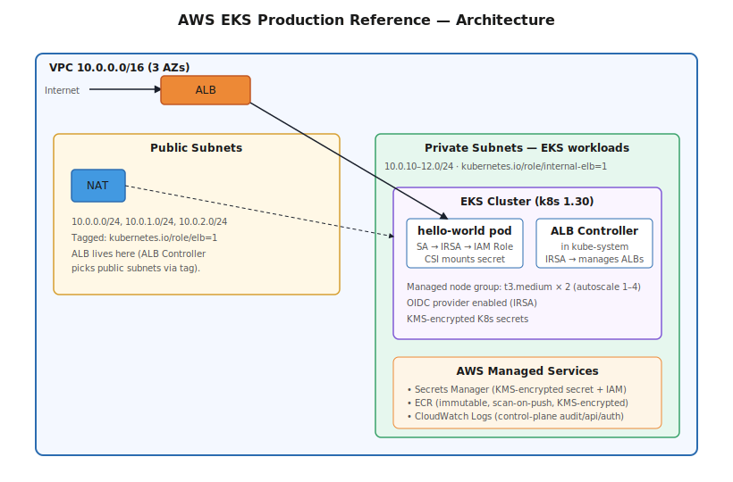

# AWS EKS — Production Reference (Terraform + ArgoCD-ready)

A production-grade AWS EKS cluster built with Terraform. VPC, IRSA, ALB Controller, AWS Secrets Manager via the CSI driver, ECR, and a sample Node.js application. Designed to be the starting point for any new AWS Kubernetes workload — clean, secure-by-default, no over-engineering.



## What it builds

| Layer | Resources |
|---|---|
| Network | VPC (3 public + 3 private subnets across 3 AZs), IGW, single NAT, route tables |
| EKS | Managed cluster (Kubernetes 1.30), managed node group (`t3.medium` × 2), IRSA (OIDC) enabled |
| Container registry | ECR repo with scan-on-push and immutable tags |
| Ingress | AWS Load Balancer Controller via Helm, configured for IRSA |
| Secrets | AWS Secrets Manager + Secrets Store CSI driver, secrets mounted as files / env vars in pods |
| Encryption | KMS-encrypted EKS secrets, ECR images, and Secrets Manager values |
| Sample app | Node.js Express app, multi-stage Dockerfile, K8s manifests, served via ALB |

## Stack

- Terraform `>= 1.5`, AWS Provider `~> 5.0`
- Kubernetes `1.30`
- Helm `3.x` (for ALB Controller + CSI driver)
- Region: `us-east-1` (configurable)

## Quick start

```bash
git clone https://github.com/your-username/aws-eks-production-terraform.git
cd aws-eks-production-terraform/terraform

terraform init
terraform plan
terraform apply

# Configure kubectl
aws eks update-kubeconfig --region us-east-1 --name $(terraform output -raw cluster_name)
kubectl get nodes
```

Then deploy the sample app:

```bash
cd ../scripts
./build-and-push.sh v0.1.0   # builds + pushes to ECR
./deploy-app.sh              # applies K8s manifests
./get-alb-url.sh             # waits ~2 min for ALB, then prints URL
```

## Project structure

```
aws-eks-production-terraform/
├── README.md
├── terraform/
│   ├── main.tf              # Backend, providers, common locals
│   ├── variables.tf
│   ├── outputs.tf
│   ├── vpc.tf               # VPC + subnets + NAT + IGW (with EKS-required tags)
│   ├── eks.tf               # Cluster, node group, OIDC provider
│   ├── iam.tf               # Cluster + node IAM roles
│   ├── ecr.tf               # ECR repo (KMS-encrypted, immutable, scan-on-push)
│   ├── alb-controller.tf    # IAM for ALB Controller via IRSA + Helm release
│   └── secrets.tf           # KMS key, Secrets Manager secret, IRSA for app
├── app/
│   ├── Dockerfile
│   ├── package.json
│   ├── server.js
│   └── k8s/
│       ├── namespace.yaml
│       ├── serviceaccount.yaml      # Annotated with IRSA role ARN
│       ├── secretproviderclass.yaml # CSI driver secret config
│       ├── deployment.yaml
│       ├── service.yaml
│       └── ingress.yaml             # ALB-backed, public-facing
├── scripts/
│   ├── build-and-push.sh
│   ├── deploy-app.sh
│   ├── get-alb-url.sh
│   └── cleanup.sh
└── docs/
    ├── architecture.svg
    └── COST-BREAKDOWN.md
```

## Security model

- **IRSA** for pod IAM — no long-lived AWS keys in cluster
- **AWS Secrets Manager + CSI driver** — secrets injected as files/env, never in YAML
- **KMS encryption** — EKS envelope encryption for K8s secrets, ECR image layers, Secrets Manager
- **Private node group** — nodes in private subnets only
- **No SSH access** — use SSM Session Manager if you add a bastion (not included; keeps this repo focused on EKS)
- **IMDSv2 enforced** at the launch template level
- **ECR immutable tags** — prevents accidental tag overwrites in CI

## Cost estimate

| Resource | Approx. monthly |
|---|---|
| EKS control plane | $73 |
| 2× t3.medium nodes | ~$60 |
| 1× NAT Gateway | ~$32 |
| 1× ALB | ~$16 |
| Secrets Manager (1 secret) | ~$0.40 |
| CloudWatch logs (modest) | ~$5 |
| ECR storage | ~$1 |
| **Total** | **~$190/month** |

See `docs/COST-BREAKDOWN.md` for line-by-line and optimization tips.

## What this repo deliberately doesn't include

So it stays a **clean reference** rather than a prod-deployment-in-disguise:

- ❌ Bastion host / SSM (use SSM Session Manager from the API if needed)
- ❌ External-DNS, cert-manager, monitoring stack — add these via downstream Helm releases per workload
- ❌ Multi-region failover — out of scope for a starter
- ❌ Spot instances — easy to add (set `capacity_type = "SPOT"` on the node group)

## Cleanup

```bash
cd terraform
terraform destroy    # ~5 min; removes everything except CloudWatch log retention
```

## License

MIT
